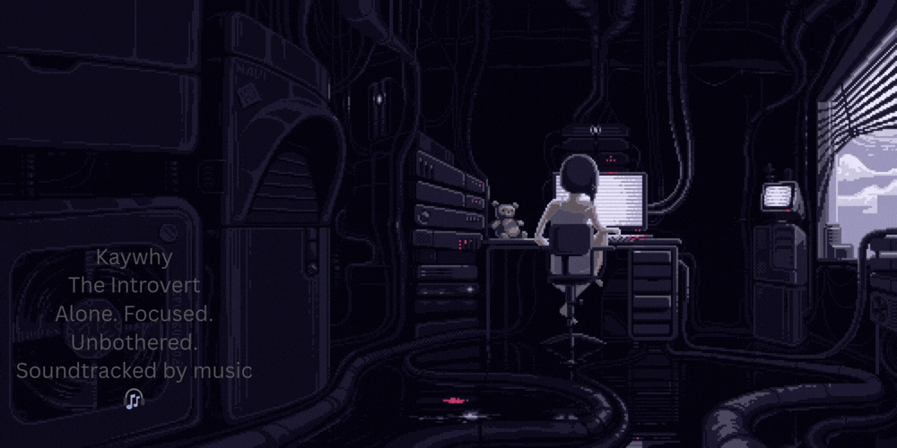

<h1 align="center">Hi , I'm Kaywhy</h1>
<h3 align="center"> Full Stack JavaScript Developer | AI Builder | Growth-Driven</h3>

<br/>

<div align="center">
  
</div>

<br/>

 🧠 About Me

- 🔥 Never Ignore Growth — Hustle Till Mastery, Achieve, Repeat, Evolve  
- 🤖 Building AI-powered applications with JavaScript  
- 🌍 Focused on becoming elite in Full Stack Engineering  
- ⚡ Started 2026. Building for longevity.

---

## 🌐 Connect With Me

<p align="center">
<a href="https://x.com/yungleb190833" target="_blank">

</a>

<a href="https://www.linkedin.com/in/ajayi-oluwakanyinsola-6a2103287/" target="_blank">

</a>

<a href="https://www.instagram.com/kaywhy.18/" target="_blank">

</a>

<a href="https://leetcode.com/u/kaywhy18/" target="_blank">

</a>
</p>

---

## 🛠️ Tech Stack

<p align="center">


</p>

---

## ⚡ Mindset

```js
const mindset = {
  I: "Ignore Nothing",
  G: "Growth",
  H: "Hustle",
  T: "Till Mastery",
  M: "Mastery",
  A: "Achieve",
  R: "Repeat",
  E: "Evolve"
};

console.log("Built different. Growing daily.");
